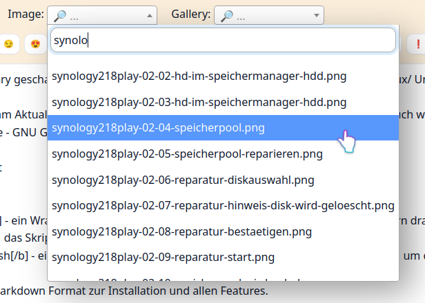

# Select2 plugin for FlatPress

**FlatPress** is a lightweight, easy-to-set-up blogging engine. 

🌐 <https://www.flatpress.org/>

**Select2** - The jQuery replacement for select boxes

🌐 <https://select2.org/>


---

The Flatpress plugin **Select2** adds a text filter to select boxes in the admin area using Select2.

Just download and enable it - then it runs.

👤 Author: Axel Hahn \
📄 Source: <https://github.com/axelhahn/fp-plugin-select2> \
📜 License: GNU GPL 3.0

Flatpress Plugin page <https://wiki.flatpress.org/res:plugins:select2>

## 🖥️ Screenshot



## 👉 Requirements

It was developed 

* on **FlatPress 1.5** - but it could run on an older version (send me a notice if so)
* with **PHP 8.5** (and should run on supported 8.x versions of PHP)
* Select2 needs **jQuery** to run

## 🪄 Get the plugin

You have 2 options to get the plugin. Select between

* Download as zip file and extract it
* Git clone its sources

### Download as zip file

 Download the zip file from Github:

<https://github.com/axelhahn/fp-plugin-select2/archive/refs/heads/main.zip>

Extract it and put its files into

`<flatpress>/fp-plugins/`

### Git clone

Go to the fp-plugins folder of your FlatPress installation. There clone the repository with the following command:

```shell
cd <flatpress>/fp-plugins/
git clone https://github.com/axelhahn/fp-plugin-select2.git select2
```

## ✅ Enable plugin

In the FlatPress admin, go to the Plugins page, then enable the plugin.

## 🧾 Changelog

* 2026-06-29 - 1.0.0 - Initial release
